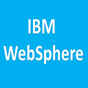
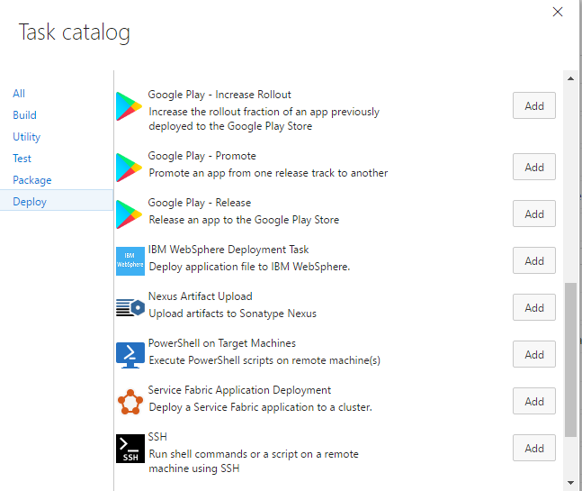
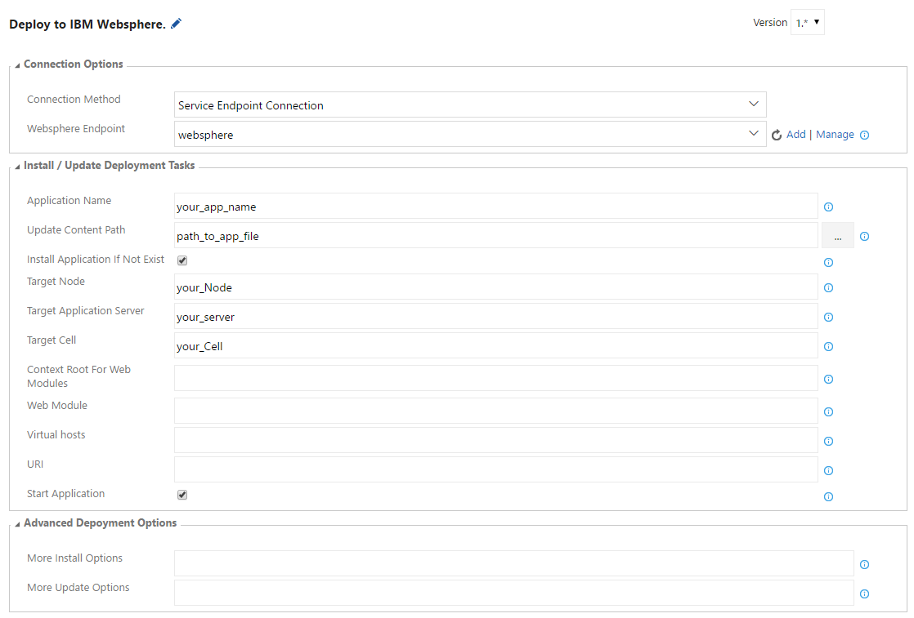
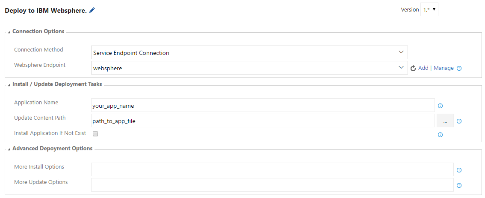
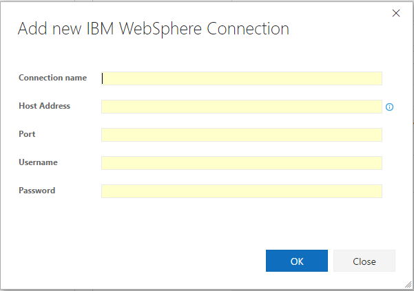

<table style="width: 100%; border-style: none;"><tr>
<td width="140px" style="text-align: center;"></td>
<td><strong>Visual Studio Team Services Extension for IBM WebSphere</strong> 
<i>Provides deployment tasks that automatically install/update WebSpherer enterprise applications in WebSphere application servers.</i> 
<a href="https://marketplace.visualstudio.com/items/ms-vsclient.app-store">Install now!</a>
</td>
</tr></table>

# Visual Studio Team Services Extension for IBM WebSphere

This extension contains a deployment tasks which allow you to automate the installation and update of WebSpherer enterprise applications to WebSphere application servers. This extension installs the following components:
* A service endpoint for connecting to IBM WebSphere on Visual Studio Team Services and Team Foundation Server 2017.
* A build task to install / update WebSpherer enterprise applications on WebSphere application servers.

## Prerequisites

* In order to automate the installation and update of WebSpherer enterprise applications to WebSphere application servers, the build agent must have access to the 'wsadmin' commands. The build taks mainly runs 'wsadmin' to perform
install / update task, so make sure it works at first. Please follow the IBM WebSphere document to setup the command environment. 
There are three things you can check:
  * You can run wsadmin.sh(Linux) / wsadmin.bat(Windows) command from the command line. Add the IBM WebSphere bin/ directory in the PATH.
  * Try to run "wsadmin.sh -conntype SOAP -host your_websphere_hostname -port your_websphere_SOAP_port -username your_username -password your_password -c AdminControl.getNode\(\)" 
  on the build agent. If it runs correctly, it will return the node name of IBM WebSphere Application servers.
  * Sometimes you need to create a profile in your build agent to make the command line work.

## Quick Start

Once you have set up the WebSphere environemnt in both your server and build agent, perform the following steps to automate install / update WebSphere enterprise applications:

1. Install the IBM WebSphere extension from the [VSTS Marketplace](https://marketplace.visualstudio.com/items/ms-vsclient.app-store).

2. Go to your Visual Studio Team Services or TFS project, click on the **Build** tab, and create a new build definition (the "+" icon) that is hooked up to your project's appropriate source repository.

3. Click **Add build step...** and select the necessary tasks to generate your release assets (e.g. **Gulp**, **Cordova Build**).

4. Click **Add build step...** and select **IBM WebSphere ** from the **Deploy** category.

5. Configure the **IBM Websphere Deploment Task** task with the desired authentication method, and the install / update options.

6. Click the **Queue Build** button or push a change to your configured repository in order to run the newly defined build.

7. Your Webpshere application changes will now be automatically installed / updated to the Websphere Application servers!

## IBM WebSphere Application Deployment Task

1. Open your build definition and add the "IBM WebSphere Deployment" task.  The task can be found in the 'Deploy' section.

    

1. Details of the install / update deployment task. Note that this task includes both install and update cases. If the target application does not exist, 
it will install it; Otherwise it will update the target application.

    

    * Setup [Connection Options](#setup-connection-options).
    * Enter the application name.
    * Enter the update content path. This should be the path points to the application file. Wildcards can be used, but the pattern must resolve to exactly one file.
    * By default "Install Application If Not Exist" is checked. It will ask you more information about the applications. If the application does not exist, it will install this application. 
    If the application already exists, it will update the application. The deployment task can detect and decide the right case for you. There is no need to add separate tasks for installation and update.
    If you are certain that you only want to update an existing application, uncheck this option.
    * Enter the target node name, target application server name, and the target cell name.
    * Enter the context root information. If it leaves blank, the default context root will be "/your_application_name".
    * Enter the Web Module, Virtual Host, and URI information. They are optional. We can extract these information automatically from the application file.
    * By default "Start Application" is checked. It will start the application after the installation.

1. If you are certain that the target application already exists in the WebSphere server, you can uncheck the "Install Application If Not Exist". The update task can be shown as follows:

    

### Setup Connection Options

The tasks provide two options to connect to IBM WebSphere:

1. Connecting with an "IBM WebSphere" endpoint.
    * This option is supported on Visual Studio Team Services and Team Foundation Server 2017.  On Team Foundation Server 2015, please use other options to connect.

    

    * __Connection name__: name used to identify this connection.
    * __Hostname / IP Address__: IP address or the hostname of the computer on which the IBM WebSphere is running. The hostname must be resolvable by the build agent. Do not prefix with protocol names.
    * __Port__: SOAP port of the target WebSphere.
    * __Username and Password__: Administrative user name and password of the target WebSphere. Make you can use this pair to login the WebSphere console.

1. Manually enter credentials.
    * The same fields from "IBM WebSphere" endpoint section are repeated within the task.

## Support
Support for this extension is provided on our [GitHub Issue Tracker](https://github.com/microsoft/vsts-ibm-websphere-extension/issues).  You
can submit a [bug report](https://github.com/microsoft/vsts-ibm-websphere-extension/issues/new), a [feature request](https://github.com/microsoft/vsts-ibm-websphere-extension/issues/new)
or participate in [discussions](https://github.com/microsoft/vsts-ibm-websphere-extension/issues).

## Contributing to the Extension
See the [developer documentation](CONTRIBUTING.md) for details on how to contribute to this extension.

## Code of Conduct
This project has adopted the [Microsoft Open Source Code of Conduct](https://opensource.microsoft.com/codeofconduct/). For more information see the [Code of Conduct FAQ](https://opensource.microsoft.com/codeofconduct/faq/) or contact [opencode@microsoft.com](mailto:opencode@microsoft.com) with any additional questions or comments.

## Privacy Statement
The [Microsoft Visual Studio Product Family Privacy Statement](http://go.microsoft.com/fwlink/?LinkId=528096&clcid=0x409)
describes the privacy statement of this software.
